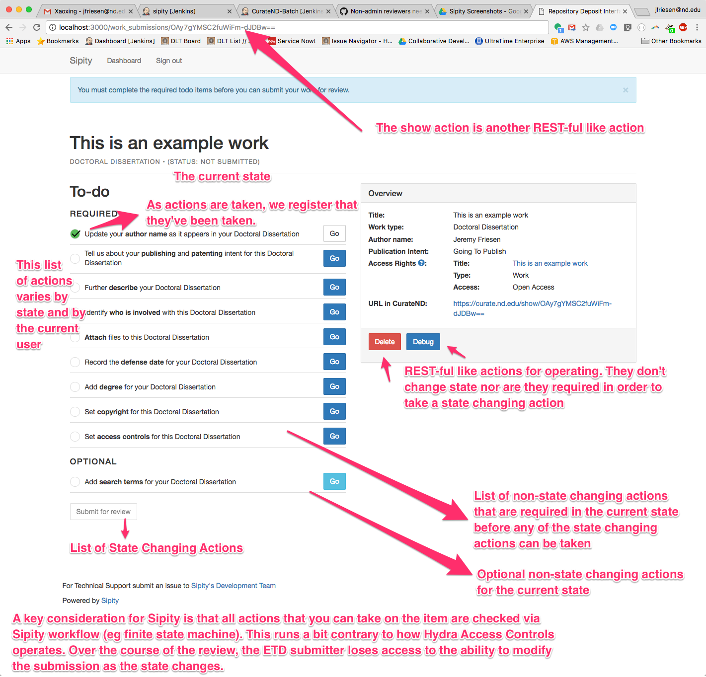
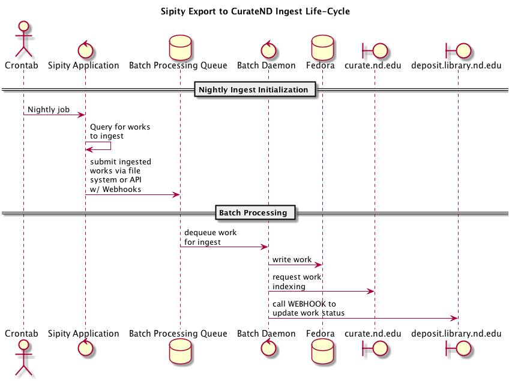

# Sipity

[](https://travis-ci.org/ndlib/sipity)
[](https://codeclimate.com/github/ndlib/sipity)
[](https://codeclimate.com/github/ndlib/sipity)
[](http://inch-ci.org/github/ndlib/sipity)
[](./LICENSE)
[](./CONTRIBUTING.md)

A plugin-ready and extensible Rails application for modeling approval style workflows.

**Sipity is a collaborative multi-step checklist, with strict authorization concerns.**  Read more about it's [History and High Level Concepts](artifacts/on-system-levels-schemas-json-and-adding-to-a-workflow.md).

**Q: Is it ready for other people to use?**
_A: No. However it has been designed to extract Notre Dame specific information into a separate plugin._

**Q: Why would we want to use and build upon Sipity instead of rolling our own?**
_A: Good question. Depends on your use cases. Sipity is built with the idea of approval steps and custom forms. It is not yet a generalized application. However, it is our teams observations and response to how shared Rails applications fail._

**Q: What is appealing about Sipity? In otherwords how might it work for me?**
_A: Sipity keeps business logic/validation separate from process/approval modeling separate from captured metadata. It has naive assumptions but those are isolated and provide a place to work from._

Sipity is a patron-oriented deposit interface into CurateND.
Its goal is to provide clarity on why a patron would want to fill out metadata information.

## Getting Your Bearings

### Running Locally

Sipity is a [Ruby on Rails](https://rubyonrails.org) application. To run locally you will need:

1) Ruby
2) Mysql

Assuming you have a Mac OSX machine:

1.  Download [homebrew](https://brew.sh) - package manager for OSX
2.  Install rbenv via home brew (e.g. `brew install rbenv`) - a ruby version manager
3.  Install mysql via home brew (e.g. `brew install mysql`)
4.  Install the ruby version that matches [Sipity's .ruby-version](./.ruby-version)
5.  Clone the Sipity repository to your machine
6.  In the Sipity repository install the dependencies via bundler (e.g. `bundle install`)
7.  Test the installation by running the rake command (e.g. `bundle exec rake`)

_**Note:** Because OSX is squirrelly about it's command line ecosystem, you may encounter bumps
along the way. You can find some possible guidance at [jeremyf/dotzshrc's runbooks](https://github.com/jeremyf/dotzshrc/tree/master/runbooks)._

### Starting the Application

To run the application, use the following commands:

```console
mysql.server start
bundle exec rake db:drop db:create
rake bootstrap
bundle exec bin/rails s
```
Then go to http://localhost:3000

### Running with Authentication (in Development)

You will need the Okta environment variables file.
By default Sipity has "fakey" parameters for those (see
[./config/application.yml](./config/application.yml) for the expected
environment variables).

Once you have the Okta You will need the Okta environment variables file,
you'll need to "bash" that file (see below). This will export those
environment variables and Figaro can then pick them up.

```console
. <path/to/okta/environment/variables.txt>
````

### Development Seeds

`rake bootstrap` - reset the environment's database with basic seed data

In `./lib/tasks/development.rake` you can find Rake tasks for adding data.

### Work Submission

The primary feature (and complexity) is Sipity's work submission show page. Below is a diagram that helps break down its composition.



Sipity is a Rails application but is built with a few more concepts in mind.


Or if you can leverage the command line.


Or if you'd like to see how `cron` jobs are scheduled, look in [config/schedule.rb](config/schedule.rb).

### Exporting the Data for Batch Ingesting

Sipity data is exported via [CurateND Batch](https://github.com/ndlib/curatend-batch).

By default, Sipity uses the CurateND batch API to load the data for ingest into Curate. To test the export process in localhost:
- Start the [curate-batch ingestor](https://github.com/ndlib/curatend-batch#getting-started).
- Run the [Bulk Ingest Job](https://github.com/ndlib/sipity/blob/master/config/schedule.rb#L15) from the command line. Resulting data will be loaded into the `/curatend-batch/test` directory within your GO directory.

To test the exporter using the file system, change the [default ingest method](https://github.com/ndlib/sipity/blob/master/app/exporters/sipity/exporters/batch_ingest_exporter.rb#L48) to :files. The resulting data will load inside your app's `/local` directory.

####  Sipity::Jobs::Core::BulkIngestJob conceptual call stack

1. [Sipity::Jobs::Core::BulkIngestJob](https://github.com/ndlib/sipity/blob/master/app/jobs/sipity/jobs/core/bulk_ingest_job.rb)
  - Which calls Sipity::Jobs::Core::PerformActionForWorkJob ([at line #63](https://github.com/ndlib/sipity/blob/master/app/jobs/sipity/jobs/core/bulk_ingest_job.rb#L63))
    - For "ready_for_ingest" state ([see `#default_initial_processing_state_name` at #94](https://github.com/ndlib/sipity/blob/master/app/jobs/sipity/jobs/core/bulk_ingest_job.rb#L94))
    - Using the "submit_for_ingest" action ([see `#default_processing_action_name' line #101](https://github.com/ndlib/sipity/blob/master/app/jobs/sipity/jobs/core/bulk_ingest_job.rb#L101))
      - The "submit_for_ingest" means it should use the [Sipity::Forms::WorkSubmissions::Core::SubmitForIngestForm](https://github.com/ndlib/sipity/blob/master/app/forms/sipity/forms/work_submissions/core/submit_for_ingest_form.rb) object when it attempts to ingest each object.
      - Note: By using the Form object, the Batch ingestor confirms to the same security model as the web application. The batch ingester may only see and act on objects to which it has permissions.
2. [Sipity::Jobs::Core::PerformActionForWorkJob](https://github.com/ndlib/sipity/blob/master/app/jobs/sipity/jobs/core/perform_action_for_work_job.rb)
  - This builds the request/response/authorization context to submit the "submit_for_ingest" form object.
3. With permissions enforced and a proper context, run the [Sipity::Exporters::BatchIngestExporter](https://github.com/ndlib/sipity/blob/master/app/exporters/sipity/exporters/batch_ingest_exporter.rb) for the given work.

The following command can be used to circumvent the entire batch process and force a work to be ingested. You'll need to SSH to the given machine and `cd` into the current application directory.

You'll need to replace <GIVEN_WORK_ID> with the correct ID for the work. You'll need to specify the <RAILS_ENV> as well.

```console
$ bundle exec rails runner "puts Sipity::Exporters::BatchIngestExporter.call(Sipity::Models::Work.find(work:  '<GIVEN_WORK_ID>'))" -e <RAILS_ENV>
```

## Anatomy of Sipity

Below is a list of the various concepts of Sipity.

```
app
|-- assets
|-- constraints
|-- controllers
|-- conversions
|-- data_generators
|-- decorators
|-- exceptions
|-- exporters
|-- forms
|-- jobs
|-- mailers
|-- mappers
|-- models
|-- parameters
|-- policies
|-- presenters
|-- processing_hooks
|-- repositories
|-- response_handlers
|-- runners
|-- services
|-- validators
|-- views
```

### Cohesion, Orthogonality, and Decoupling

I am working to keep the various concepts of Sipity loosely coupled.
I use the various `rake spec:coverage:<layer>` tasks to help me understand how each layer's specs cover that layer's code.

My conjecture is that if each layer's specs cover the entire layer:

* I have a well documented internal API.
* My feature tests can focus on integration of the various layers.

### Assets, Controllers, Helpers, Mailers, Models, Views

The usual Rails suspects.

Jeremy's Admonition:

* **Though shalt not put behavior in ActiveRecord objects**
  - This means:
    * No before/after save callbacks - prefer repository service/command objects/methods
    * No query scopes - prefer repository query objects/methods
    * No conditional validations - prefer form objects
  - Why?
    * Because the data structures are important, but "creating the universe" everytime you want to deal with a persisted object is insanity.
* **Though shalt not use ActionController filters**
  - This means:
    * Pushing authentication to another layer
    * Pushing authorization to another layer
    * Pushing cache management to another layer
    * Avoid before/after filters
  - Why?
    * Because controllers have enough stuff going on; They are often hard to test.
      - Ensuring you have the correct parameters
      - Mapping the results of the action to a response
      - Communicating any messages
      - In other words, they already have enough reasons to change.
* **Though shalt think about command line interaction**
  - This means:
    * The controllers are one of many possible clients for the underlying application.
  - Why?
    * Because if you can disentangle your application from the web pages, you will have a richer application.

### Conversions

Taking a cue from [Avdi Grimm's "Confident Ruby"](http://www.confidentruby.com/), Conversions are responsible for coercing the input to another format. These are similar to `Array()` function.

The Conversions modules are designed to be either:

* callable via module functions
* include-able and thus expose an underlying conversion method


When adding a new attribute to the model, the appropriate converter will also need to be modified.

Find out more about [Sipity's Conversions](https://github.com/ndlib/sipity/blob/master/app/conversions/sipity/conversions.rb)

### Decorators

Models are great for holding data.
Decorators are useful for collecting that data into meaningful information.

Take a look at the [Draper gem](https://github.com/drapergem/draper). It does a
great job of explaining their importance.

Find out more about [Sipity's Decorators](https://github.com/ndlib/sipity/blob/master/app/decorators/sipity/decorators.rb)

### Forms

Forms are a class of objects that are different from models. They may represent
a subset of a single model's attributes, or be a composition of multiple
objects.

Regardless their purpose is to:

* Expose attributes
* Validate attributes

They are things that could be rendered via the `simple_form_for` view template
method.

As of the writing of this, I'm not making use of Nick Sutterer's fantastic
Reform gem. Though it could make its way into this application.

Find out more about [Sipity's Forms](https://github.com/ndlib/sipity/blob/master/app/forms/sipity/forms.rb)

### Jobs

There are certain things you don't want to do during the HTTP request cycle.
Expensive calculations, remote service calls, etc.

Find out more about [Sipity's Jobs](https://github.com/ndlib/sipity/blob/master/app/jobs/sipity/jobs.rb)

**Note: With the imminent arrival of the ActiveJob into Rails 4.2, this subsystem may undergo a change.**

### Policies

Take a look at the [Pundit gem](https://github.com/elabs/pundit). Sipity is
implementing policies that adhere to the interface of Pundit Policy and Scope
objects.

Find out more about [Sipity's Policies](https://github.com/ndlib/sipity/blob/master/app/policies/sipity/policies.rb)

### Repositories

Of particular note is the Sipity::Repository class. Here are methods for
interacting with the persistence layer; either by way of commands or queries.

Find out more about [Sipity's Repositories](https://github.com/ndlib/sipity/blob/master/app/repositories/sipity/repository.rb)

### Runners

This is a step towards crafting a single class per Controller action.
They are an implementation idea of the late Jim Weirich and provide a fantastic
means of pulling even more logic out of the overworked Rails controller.

Find out more about [Sipity's Runners](https://github.com/ndlib/sipity/blob/master/app/runners/sipity/runners.rb)

### Services

The grand dumping ground of classes that do a bit more than conversions and
may not be a direct interaction with the repository.

Find out more about [Sipity's Services](https://github.com/ndlib/sipity/blob/master/app/services/sipity/services.rb)

### Validators

Because we have a need for custom validation.

### Models

For completeness, including a rudimentary Entity Relationship Diagram (ERD).


## Relationship Between Forms, Models, and Decorators

* A decorator exposes a _logical group_ attributes that a user can see.
* A form exposes a _logical group_ of attributes for a user to edit.
* A model persists attributes in a _normalized_ manner.

A decorator's attributes may be queried from numerous models.

A form's attributes may end up persisted across numerous models.
The initial value for any of those attributes may be retrieved from persisted models.

Multiple forms may exist that modify the same underlying attribute.

For example, we ask our patrons to provide a title when they create a work.
If the patron then assigns DOI, there is a form that exposes the same title along with other attributes (i.e. publisher).
If the patron then assigns a citation, and filled out a DOI, we'll leverage the same publisher as reported.

The fundamental idea is that we are providing different contexts for our patrons to fill out information.
And each metadatum may be shared across different contexts.

The idea is stretched further, as we consider something like an geo-spatial data.

If one context is "Tell us about your geo-spatial data" then that data will be required.
If you don't want to fill it out, cancel what you are doing.

If another context is "Tell us about your metadata" and we expose geo-spatial data, then that data would not be required.

## Why Do Some Repository Methods Use Service Objects?

> Why do some repository methods delegate to a service object and
> other methods have inline behavior?

My short answer is that methods are very readable, but classes allow
encapsulation of ideas. So, as a repository method gets more
complicated it becomes a primary candidate for factoring into a class.

Another way to think about it is that repository methods provide a
convenience method for Presenter and Form interaction with the data.

My suspicion is that each form should leverage a collaborating service
class instead of service method(s); The service class could be swapped
out as well. But forms are a complicated critter; They need data from
the persistence layer and need to issue a command to update the
persistence layer. (They leverage both commands and queries).

With the separation of CommandRepository and QueryRepository, our code
is at a point where forms could be composed of a QueryService and
CommandService object. And that is how things may move going forward.
But for now we factor towards an understanding of how our code is
growing and taking shape.

## Users, Groups, and Actors

Sipity has three concepts that are important when considering permissions:

* [User](app/models/user.rb) - a NetID backed person leveraging the ubiqutous [Devise gem](https://github.com/plataformatec/devise)
* [Sipity::Models::Group](app/models/sipity/models/group.rb) - represents a set of Users in which there is a logicl business connection.
* [Sipity::Models::Processing::Actor](app/models/sipity/models/processing/actor.rb) - the Object in which permissions are checked against. An Actor is associated with either a User or a Group – via a polymorphic association.

When actions are taken we record both the requestor and on behalf of information. Often the requester is a User (i.e. someone logged into the system) but Sipity is really only concerned with does the User’s associated Actor have permission. So I have short-circuited the Group structure to say that these “Agents” are in fact groups. I store the group’s api key and check basic authentication to see if it includes a Group and API Key that are correct. If so I authenticate the current user as the group (again a concession of Devise).

## Creating a New Form

* Add or reuse attributes defined [`Sipity::Models::AdditionalAttribute`](app/models/sipity/models/additional_attribute.rb); Note the "title" is an attribute on the Work.
* Add the [form object](app/forms/sipity/forms/) to the correct work area.
* Add the corresponding [view template](app/views/sipity/controllers/) to the correct location
  - The name of the form object (e.g. `BannerProgramCodeForm`) informs the name of the template (e.g. `banner_program_code.html.erb`)
* Add the form's processing action name to the corresponding workflow; The convention for processing_action_name is the form's demodulized object name in underscore format without the '\_form' (e.g. `BannerProgramCodeForm` has an action name for `banner_program_code`)
  - You may find it helpful to review the [`Sipity::DataGenerators::ProcessingActionSchema`](app/data_generators/sipity/data_generators/processing_action_schema.rb) to better understand the JSON schema.
* Add the new attribute to the appropriate metadata converter for inclusion in the ingest into Curate. See [Conversions](https://github.com/ndlib/sipity#conversions) for more information.


## Generating the State Machine Diagram

The following command uses the database entries to regenerate the DOT-notation files in `artifacts/state_machines/*.dot`:

```console
$ bundle exec rails runner scripts/commands/generate_state_machine_diagrams.rb
```

You can use Graphviz to create a visual representation of that graph. On OS X, use `brew install graphviz` to install.

Convert the dot file into pdf format and save it in the same directory with Graphviz using `dot -Tpdf artifacts/state_machines/doctoral_dissertation_processing.dot -O`

**NOTE:** If you have created JSON entries for the workflow in `app/data_generators/sipity/data_generators`, you'll need to load those JSON documents into the database. You can use `rake bootstrap` (which will obliterate your existing data and start fresh) or `rake db:seeds` to reload the data. *My personal preference in a development environment is to obliterate and start over with clean data.*

## Working with Sipity

The primary feature of Sipity is state-based permissions. It can be helpful to force an object into a given state. Use `Sipity::Services::Administrative::ForceIntoProcessingState.call` via `$ rails console`

Example: `Sipity::Services::Administrative::ForceIntoProcessingState.call(entity: Sipity::Models::Work.find(id), state: 'ready_for_ingest')`

### Get the processing status of a Sipity::Models::Work

`GET /status/:work_id`

Response document:

```json
{ "id": <:work_id>, "status": <the_status> }
```

### Batch Ingest Documentation

#### Sipity Code-Path for Batch Ingest

1. The cron entry that processes all works ready for ingest: https://github.com/ndlib/sipity/blob/master/config/schedule.rb#L15-L16
2. The object that coordinates the job for submitting all appropriate works for ingest: https://github.com/ndlib/sipity/blob/master/app/jobs/sipity/jobs/core/bulk_ingest_job.rb
3. The form object that ensures the batch ingest is authorized for the given user: https://github.com/ndlib/sipity/blob/master/app/forms/sipity/forms/work_submissions/core/submit_for_ingest_form.rb
4. Finally, the class that performs a batch ingest for a single work: https://github.com/ndlib/sipity/blob/master/app/exporters/sipity/exporters/batch_ingest_exporter.rb

#### Sequence Diagram



## Further Documentation (For internal DLT team only)
[Google doc](https://docs.google.com/document/d/1u97Ncwkg4KjKdaa53vTXaZVpTRZO2KCPYmjNVEwa7_8/edit#) from the Knowledge Transfer session on 03/23/2018
